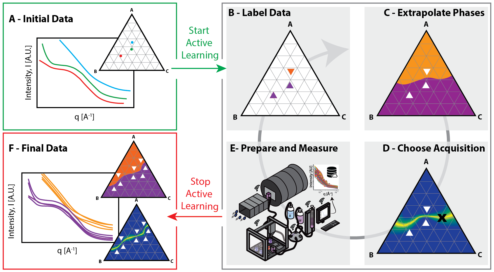

# Submission for MLMR’s Annual Materials Informatics Competition 2024
Click [here](https://github.com/martintb/active_learning_tutorial) for more information on the competition. Goal was to predict the phase map of a three-component system with **active learning**, where each experiment returns   realistic small-angle neutron scattering (SANS) data that vary with sample composition. 

The first submission employed spectral clustering for the label phase, a GaussianProcessClassifier with the RationalQuadratic kernel for the extrapolate phase and entropy for the acquire phase. 

The two alternative submissions made use of a KNN classifier for the extrapolate phase, respectively with n_neighbors=8 and 5.

